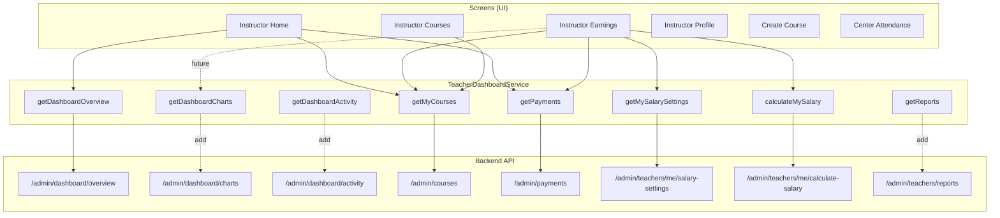

# Teacher Feature – Endpoints & Architecture

## 1. Teacher Endpoints Summary

All endpoints require `Authorization: Bearer <TOKEN>`. Backend filters data by current user for instructors.

| # | Method | Endpoint | Purpose |
|---|--------|----------|---------|
| 1 | GET | `/api/admin/dashboard/overview` | لوحة التحكم – إحصائيات (طلاب، دورات، اشتراكات، إيرادات، نمو) |
| 2 | GET | `/api/admin/dashboard/charts` | بيانات الرسوم البيانية (نمو المستخدمين، الإيرادات، إكمال الدورات) |
| 3 | GET | `/api/admin/dashboard/activity` | النشاط الأخير (مدفوعات، اشتراكات) |
| 4 | GET | `/api/admin/courses?instructorId=xxx` | دورات المدرس |
| 5 | GET | `/api/admin/payments` | مدفوعات دورات المدرس |
| 6 | GET | `/api/admin/users/me/earnings` | أرباح المدرس التفصيلية |
| 7 | GET | `/api/admin/teachers/me/salary-settings` | إعدادات المرتب |
| 8 | POST | `/api/admin/teachers/me/calculate-salary` | حساب المرتب لفترة |
| 9 | GET | `/api/admin/teachers/reports` | تقارير المدرس |
| 10 | GET | `/api/admin/attendance` | سجلات الحضور (دورات المدرس) |
| 11 | GET | `/api/admin/attendance?action=course-enrollments&courseId=xxx` | طلاب دورة محددة |
| 12 | GET | `/api/attendance/my-qr-code` | QR كود المدرس |
| 13 | GET | `/api/attendance/my-attendance` | سجلات حضور المدرس الشخصية |

---

## 2. Architecture Overview

```
┌─────────────────────────────────────────────────────────────────────────────────┐
│                           TEACHER (INSTRUCTOR) FLOW                               │
└─────────────────────────────────────────────────────────────────────────────────┘

┌──────────────────────────────────────────────────────────────────────────────────┐
│                              PRESENTATION LAYER (Screens)                          │
├──────────────────────────────────────────────────────────────────────────────────┤
│                                                                                   │
│  ┌─────────────────┐  ┌─────────────────┐  ┌─────────────────┐  ┌─────────────┐ │
│  │ Instructor      │  │ Instructor      │  │ Instructor      │  │ Instructor  │ │
│  │ Home Screen     │  │ Courses Screen  │  │ Earnings Screen │  │ Profile     │ │
│  │                 │  │                 │  │                 │  │ Screen      │ │
│  │ • Overview      │  │ • My Courses    │  │ • Salary        │  │ • Account   │ │
│  │ • Quick stats   │  │ • Search        │  │ • Charts        │  │ • Settings  │ │
│  │ • My courses    │  │ • Course cards  │  │ • Analysis      │  │ • Logout    │ │
│  └────────┬────────┘  └────────┬────────┘  └────────┬────────┘  └──────┬──────┘ │
│           │                    │                    │                   │        │
│  ┌────────┴────────┐  ┌────────┴────────┐  ┌───────┴────────┐  ┌──────┴──────┐ │
│  │ Create Course   │  │ (Future)        │  │ (Future)       │  │ Center      │ │
│  │ Screen          │  │ Course Details  │  │ Activity       │  │ Attendance  │ │
│  │ (Placeholder)   │  │ Edit (instructor│  │ Reports        │  │ QR Code     │ │
│  └─────────────────┘  │  view)          │  │ Payments List  │  │ My Attend.  │ │
│                       └─────────────────┘  └────────────────┘  └─────────────┘ │
│                                                                                   │
└───────────────────────────────────────┬───────────────────────────────────────────┘
                                        │
                                        ▼
┌──────────────────────────────────────────────────────────────────────────────────┐
│                              SERVICE LAYER (TeacherDashboardService)               │
├──────────────────────────────────────────────────────────────────────────────────┤
│                                                                                   │
│  ┌──────────────────┐  ┌──────────────────┐  ┌──────────────────┐               │
│  │ getDashboard     │  │ getMyCourses     │  │ getPayments      │               │
│  │ Overview()       │  │ (instructorId)   │  │ (filter by       │               │
│  │                  │  │                  │  │  course IDs)     │               │
│  └────────┬─────────┘  └────────┬─────────┘  └────────┬─────────┘               │
│           │                     │                     │                           │
│  ┌────────┴─────────┐  ┌────────┴─────────┐  ┌───────┴─────────┐               │
│  │ getMySalary      │  │ calculateMy      │  │ getReports      │               │
│  │ Settings()       │  │ Salary()         │  │ (teacherId,     │               │
│  │                  │  │                  │  │  dates)         │               │
│  └──────────────────┘  └──────────────────┘  └─────────────────┘               │
│                                                                                   │
│  [TO ADD] getDashboardCharts() | getDashboardActivity() | getAttendance()         │
│           getMyQrCode()        | getMyAttendance()      | getUsersEarnings()      │
│                                                                                   │
└───────────────────────────────────────┬───────────────────────────────────────────┘
                                        │
                                        ▼
┌──────────────────────────────────────────────────────────────────────────────────┐
│                              API LAYER (ApiEndpoints + ApiClient)                  │
├──────────────────────────────────────────────────────────────────────────────────┤
│                                                                                   │
│  Base: https://stp.anmka.com/api                                                  │
│  Auth: Bearer Token (from TokenStorageService)                                    │
│                                                                                   │
│  /admin/dashboard/overview     ✓                                                  │
│  /admin/dashboard/charts       ✗ (not in api_endpoints)                           │
│  /admin/dashboard/activity     ✗ (not in api_endpoints)                           │
│  /admin/courses                ✓                                                  │
│  /admin/payments               ✓                                                  │
│  /admin/teachers/me/salary-settings     ✓                                         │
│  /admin/teachers/me/calculate-salary    ✓                                         │
│  /admin/teachers/reports       ✓                                                  │
│  /admin/attendance             ✗ (not in api_endpoints)                           │
│  /attendance/my-qr-code        → myQrCode (different path) ✓                      │
│  /attendance/my-attendance     ✗ (not in api_endpoints)                           │
│  /admin/users/me/earnings      ✗ (not in api_endpoints)                           │
│                                                                                   │
└──────────────────────────────────────────────────────────────────────────────────┘
```

---

## 3. Endpoint → Screen Mapping

| Endpoint | Screen | Status |
|----------|--------|--------|
| `GET /admin/dashboard/overview` | Instructor Home | ✅ Used |
| `GET /admin/dashboard/charts` | Instructor Home / Earnings | ⚠️ Not called – use for charts |
| `GET /admin/dashboard/activity` | (Future) Activity / Feed | ❌ Not implemented |
| `GET /admin/courses?instructorId=` | Instructor Courses | ✅ Used |
| `GET /admin/payments` | Instructor Earnings | ✅ Used (filtered client-side) |
| `GET /admin/users/me/earnings` | Instructor Earnings | ❌ Not used – could replace client aggregation |
| `GET /admin/teachers/me/salary-settings` | Instructor Earnings | ✅ Used |
| `POST /admin/teachers/me/calculate-salary` | Instructor Earnings | ✅ Used |
| `GET /admin/teachers/reports` | (Future) Reports Screen | ❌ Not implemented |
| `GET /admin/attendance` | Center Attendance | ⚠️ Check if used |
| `GET /attendance/my-qr-code` | Center Attendance (QR) | ✅ Via qr_code_service |
| `GET /attendance/my-attendance` | (Future) My Attendance | ❌ Not implemented |

---

## 4. Data Flow (Example: Earnings Screen)

```
User opens Earnings Screen
        │
        ▼
┌───────────────────────────────────────┐
│  _loadAllData()                       │
│  ├─ getMySalarySettings()             │  ← /admin/teachers/me/salary-settings
│  ├─ getProfile()                      │  ← /auth/profile (userId)
│  ├─ getDashboardOverview()            │  ← /admin/dashboard/overview
│  ├─ getMyCourses(instructorId)        │  ← /admin/courses?instructorId=
│  └─ getPayments(status: completed)    │  ← /admin/payments?status=completed
│       └─ Filter by myCourseIds        │     (client-side filter)
└───────────────────────────────────────┘
        │
        ▼
┌───────────────────────────────────────┐
│  State: _salarySettings, _overview,   │
│         _myCourses, _monthlyEarnings  │
└───────────────────────────────────────┘
        │
        ▼
┌───────────────────────────────────────┐
│  UI: Summary | Line Chart | Pie Chart │
│       Analysis | Salary Settings      │
│       Calculate | Result              │
└───────────────────────────────────────┘
```

---

## 5. Suggested Implementation Roadmap

### Phase 1 – Improve Existing (Quick Wins)
1. **Add `getDashboardCharts()`** – Use `/admin/dashboard/charts` for monthly revenue & course completion instead of client aggregation.
2. **Add `getUsersEarnings(me)`** – Use `/admin/users/me/earnings` for `byCourse`, `periodEarnings` if available.

### Phase 2 – New Screens
3. **Activity Screen** – `getDashboardActivity()` → recent payments, enrollments.
4. **Reports Screen** – `getReports()` → detailed reports with date filter.
5. **My Attendance Screen** – `getMyAttendance()` → teacher’s own attendance records.

### Phase 3 – Course Management
6. **Course Enrollments** – `GET /admin/attendance?action=course-enrollments&courseId=xxx` for course details view.
7. **Create/Edit Course** – If API supports it.

---

## 6. File Structure (Current)

```
lib/
├── core/api/
│   ├── api_endpoints.dart      # Add: dashboard/charts, activity, attendance, users/me/earnings
│   └── api_client.dart
├── services/
│   ├── teacher_dashboard_service.dart   # Add: getDashboardCharts, getActivity, getAttendance...
│   └── qr_code_service.dart             # Already: my QR
├── screens/instructor/
│   ├── instructor_home_screen.dart
│   ├── instructor_courses_screen.dart
│   ├── instructor_earnings_screen.dart
│   ├── instructor_profile_screen.dart
│   └── instructor_create_course_screen.dart
└── screens/secondary/
    └── center_attendance_screen.dart
```

---

## 7. Mermaid Architecture Diagram



---

*Generated from TEACHER_DASHBOARD_API (1).md and current codebase.*
